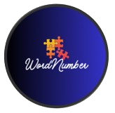
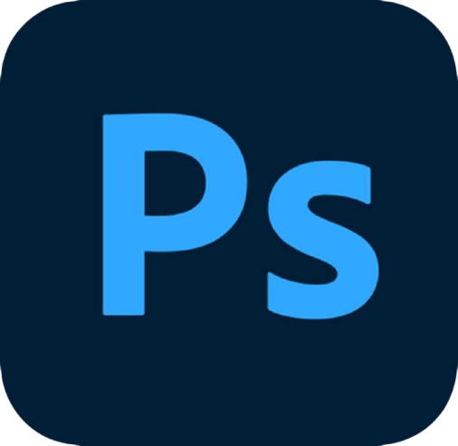

<h1 align="center">WordNumber</h1>

<p align="center">
  
</p>

---

<p align="center">
  
  
  
  
</p>

---

## 📌 Table of contents
- [About the Project](#about)
- [Documentation](#docs)
- [Installation & Setup](#install)
- [Tech Stack](#technologies)
- [Contributors](#team)

---

## Description <a name="about"></a>
Our goal is to provide a fun, engaging, and exciting experience for every player. We have created an online world that feels alive and dynamic, where anyone can join and enjoy their own personalized adventure. As you progress through the game, you’ll unlock new levels, rewards, and challenges that keep the experience fresh and entertaining. Dive in and become part of the fun!

---

## 📃 Documentation and Presentation <a name="docs"></a>
- <a href="https://codingburgas-my.sharepoint.com/:w:/g/personal/sdtanev24_codingburgas_bg/IQCpWHWb8F63QropVtFa8nL0AdvlImfrubGheZ7yfTHAkbo?e=nV4mnf">**Documentation**</a>
- <a href="https://codingburgas-my.sharepoint.com/:p:/g/personal/viivanov24_codingburgas_bg/IQABRsBXPW49TpVcCzCK4RTmAdLkY1vps0FoKbSJRVwQZys?e=fNMAXq">**Presentation**</a>

---

##  Installation and Setup <a name="install"></a>

1️⃣ **Clone our project:**
```sh
git clone https://github.com/codingburgas/sprint-math-games-9th-grade-wordnumber
```

2️⃣ **Open in IDE and run.** 

---

##  Tech Stack <a name="technologies"></a>

###  Tools:
<p>
  
  
</p>

###  Languages:
<p>
  
</p>

###  Communication:
<p>
  
</p>

###  Documentation:
<p>
  
  
</p>

###  Design:
<p>
  
</p>

---

## 👥 Team <a name="team"></a>

| Name | Role | Grade |
|------|-------|:-----:|
| [**Stoyan Tanev**](https://github.com/SDTanev24) | Scrum Trainer | 9B |
| [**Dara Sokrateva**](https://github.com/DQSokrateva24) | Backend Developer | 9A |
| [**Vilian Ivanov**](https://github.com/VIIvanov24) | Backend Developer | 9G |
| [**Kristiyan Georgiev**](https://github.com/KMGeorgiev24) | Designer | 9V |
